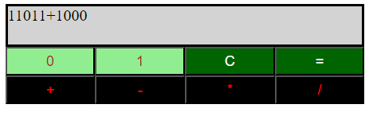
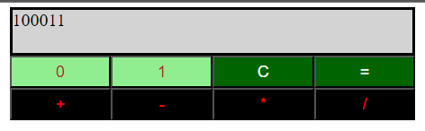

# Binary Calculator
This project is a calculator for calculating binary numbers.

- Addition 
- Subtraction 
- Multiplication 
- Division

For Example:

Before pressing the ***=*** button:

After pressing the ***=*** button:

***C*** button clears the screen.
***=*** button shows the result.
